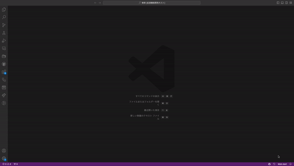

# ⏳ mob-programming-timer

This extension is a simple timer for mob programming. Set the time, start it, and it notifies when time's up. Decide to continue or finish the session when time's up.

## Features and Usage

- To use the timer, click status bar item of "Mob start", then input the time you want to set, and press enter.  
  
  

- When time is up, the timer will notify you with selection of "Start next mob" and "Finish mob".  

  
